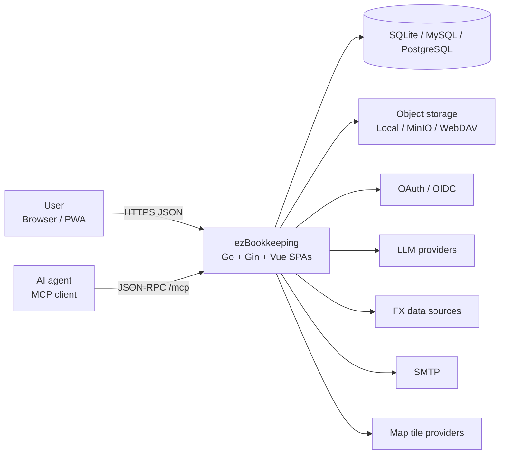
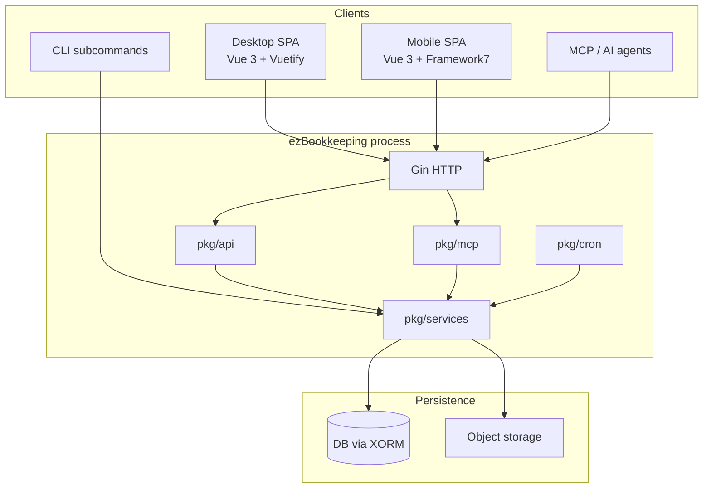

# ezBookkeeping Architecture

Lightweight, self-hosted personal finance app: **Go + Gin** backend and **Vue 3** dual SPA (desktop / mobile), packaged as a single binary / Docker image.

This folder documents the **as-built** design. No application code was changed.

## Documents

| Doc | Focus |
| --- | --- |
| [System overview](./system-overview.md) | Runtime topology, boot, deployment |
| [Backend](./backend.md) | Layers, request lifecycle, packages |
| [Frontend](./frontend.md) | Dual SPA, stores, API client, PWA |
| [Domain model](./domain-model.md) | Entities and relationships |
| [Integrations](./integrations.md) | Auth, LLM, MCP, FX, storage, import |

## System context

## High-level stack

## Design principles (observed)

1. **Single deployable** — static frontend assets + API + cron + MCP in one process.
2. **Strict layering** — `api` → `services` → `datastore` / `storage`; UI never talks to DB.
3. **Container singletons** — config-driven providers (LLM, OAuth, FX, storage, avatars).
4. **Feature flags** — routes and subsystems gated by config without recompile.
5. **Dual UI, shared core** — desktop/mobile share stores, models, and `*Base.ts` logic.
6. **Revocable auth** — JWT validated against per-token DB secrets (`TokenRecord`).
