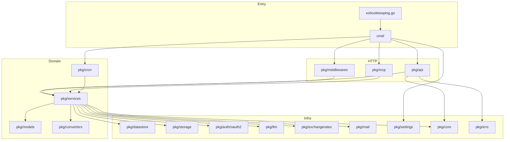
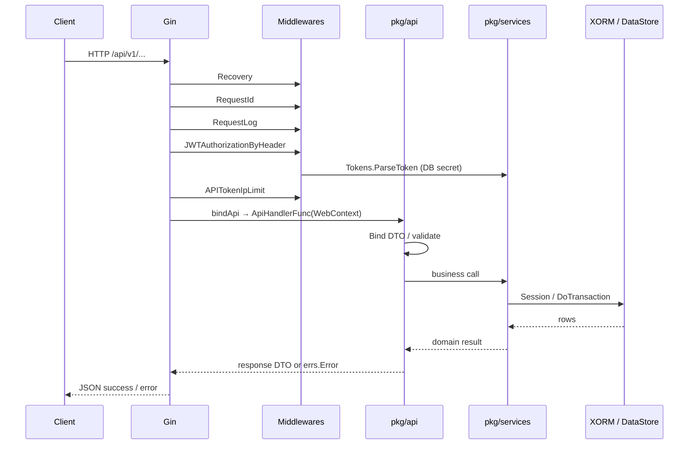
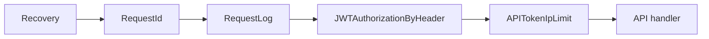
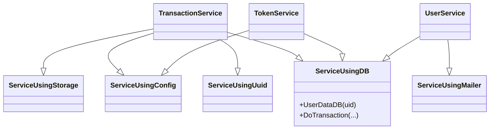
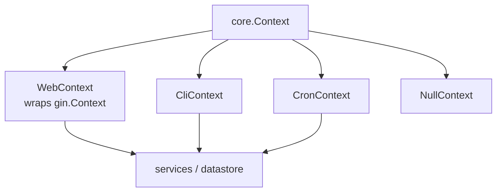
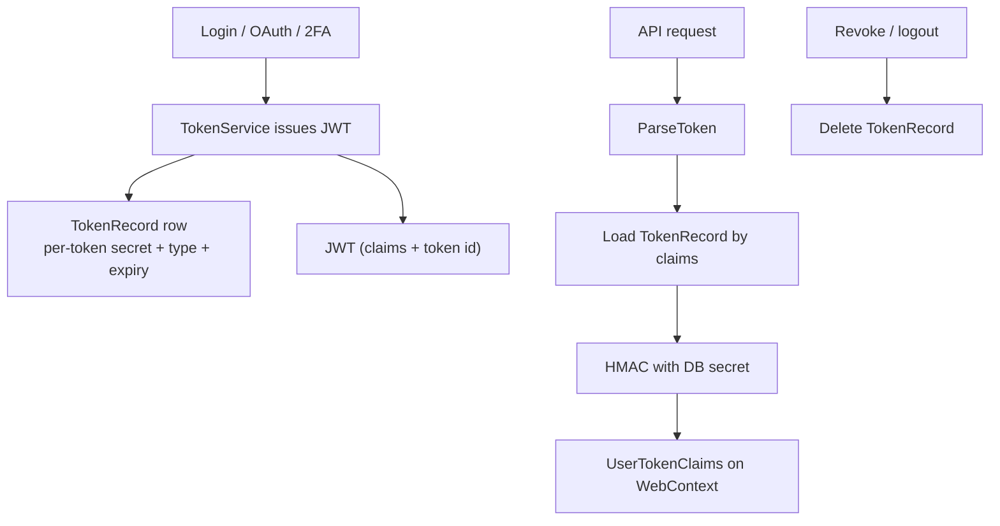
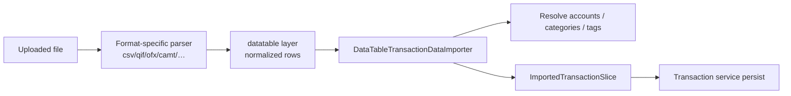

# Backend architecture

Layering: **Gin adapters → `pkg/api` → `pkg/services` → `pkg/datastore` / `pkg/storage` / providers**.

## Package map

## Request lifecycle (authenticated API)

Handler adapters in `cmd/webserver.go` keep Gin out of domain code:

| Binder | Use |
| --- | --- |
| `bindApi` | JSON success/error |
| `bindApiWithTokenUpdate` | Auth responses that rotate tokens |
| `bindJSONRPCApi` | MCP |
| `bindEventStreamApi` | Streaming |
| `bindCsv` / `bindTsv` | Exports |
| `bindImage` / `bindCachedImage` / `bindProxy` | Media & map proxy |
| `bindRedirect` / `bindLocalFile` | OAuth / static |

## Middleware chain (v1)

Other JWT variants: `JWTTwoFactorAuthorization`, `JWTOAuth2CallbackAuthorization`, `JWTEmailVerifyAuthorization`, `JWTResetPasswordAuthorization`, `JWTMCPAuthorization`.

## Service composition

Services are singletons that **embed** capability structs (`pkg/services/base.go`):

Same idea on the API side: `ApiUsingConfig`, `ApiUsingDuplicateChecker`, `ApiUsingAvatarProvider`, `ApiWithUserInfo`.

## Context abstraction

One service implementation serves HTTP, CLI, and cron.

## Auth model (JWT + DB)

Token types include NORMAL, API, MCP, REQUIRE_2FA, OAUTH2_CALLBACK, EMAIL_VERIFY, PASSWORD_RESET (see `pkg/core`).

## Cron jobs

Scheduler: `gocron` v2 via `pkg/cron`. Notable job: **scheduled transactions** (~every 15 min) → `services.Transactions.CreateScheduledTransactions`. Duplicate-checker can act as a cross-instance lock.

## Converters pipeline

Dispatcher: `pkg/converters/transaction_data_converters.go`.

## Error & response contract

- Domain errors: `pkg/errs.Error` with numeric codes.
- Success/error JSON helpers: `pkg/utils` (`PrintJsonSuccessResult` / `PrintJsonErrorResult`).
- Frontend maps known codes in `src/consts/api.ts`.
