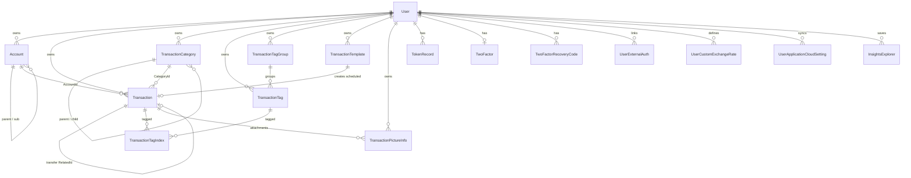
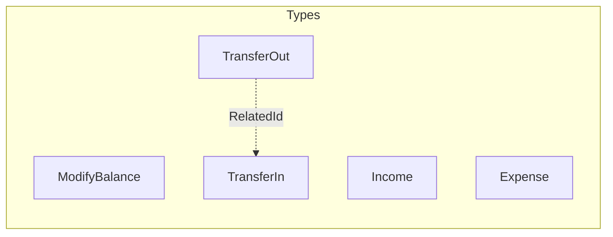
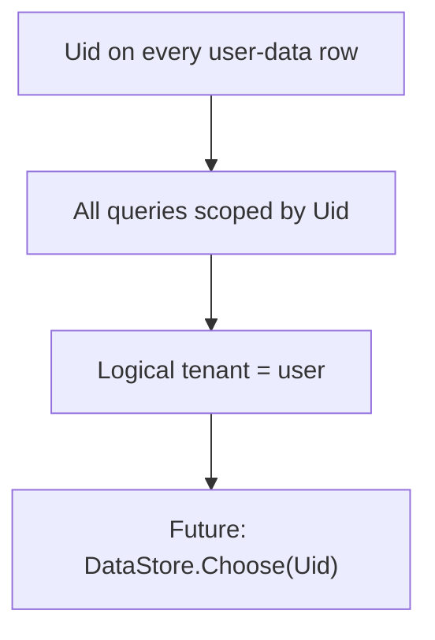
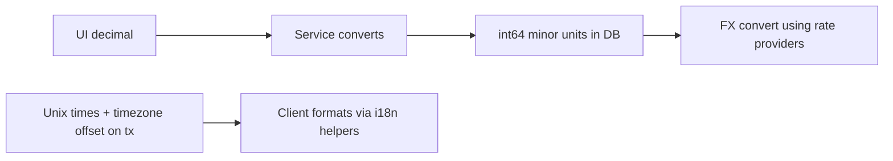

# Domain model

User-scoped bookkeeping data. Soft delete via `Deleted` + `DeletedUnixTime`. Money as **int64 minor units**. Hierarchy on accounts and categories via parent IDs.

## Entity relationship

## Core aggregates

### User & security

| Entity | Notes |
| --- | --- |
| `User` | Profile, defaults (currency, account, week/fiscal), feature restrictions |
| `TokenRecord` | Per-issued JWT secret → revoke by deleting row |
| `TwoFactor` / recovery codes | TOTP + backup codes |
| `UserExternalAuth` | OIDC / GitHub / Gitea / Nextcloud link |

### Accounts

- Categories: cash, checking, credit card, virtual, debt, receivables, investment, savings, CD, …
- Type: single vs multi-sub-accounts (`ParentAccountId`)
- `Balance` maintained with transactions; extend JSON for reconcile / statement date

### Transactions

- Transfer = **two DB rows** linked by `RelatedId` / `RelatedAccountId` / amounts.
- Optional geo, timezone offset, comment, `ScheduledCreated`.
- Tags via `TransactionTagIndex` (denormalized `TransactionTime` for filters).

### Categories, tags, templates

- Categories: Income / Expense / Transfer; two-level tree.
- Tags optional groups; many-to-many with transactions.
- Templates: `Normal` or `Schedule` (frequency fields); cron materializes scheduled txs.

### Media & analytics

- `TransactionPictureInfo` metadata; blobs in object storage `uid/pictureId.ext`.
- `InsightsExplorer` — saved custom analytic dimensions / queries.

## Ownership & multi-tenancy

No shared household entities today — one user, one book.

## Amount & time conventions

## Key model files

- `pkg/models/user.go`
- `pkg/models/account.go`
- `pkg/models/transaction.go`
- `pkg/models/transaction_category.go`
- `pkg/models/transaction_tag*.go`
- `pkg/models/transaction_template.go`
- `pkg/models/transaction_picture_info.go`
- `pkg/models/token_record.go`
- `pkg/models/explorer.go`

Frontend mirrors many of these under `src/models/` and pure logic under `src/core/`.
