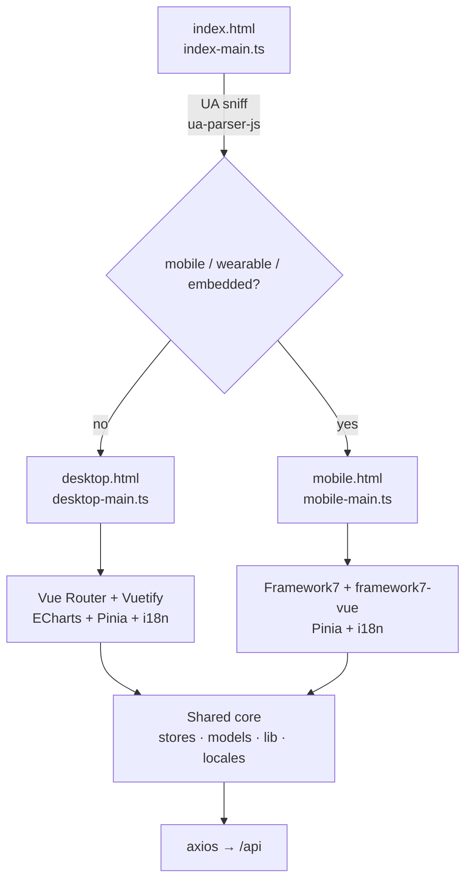
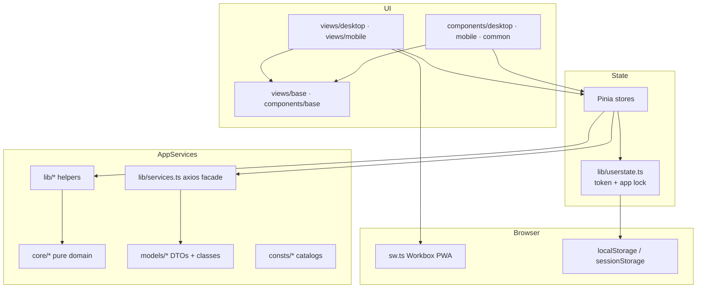
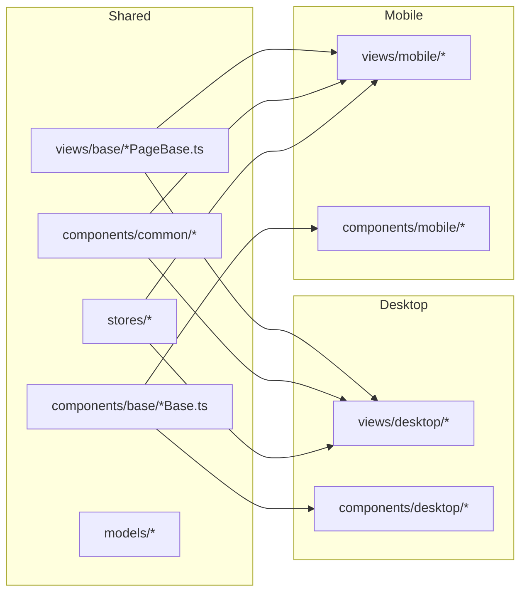
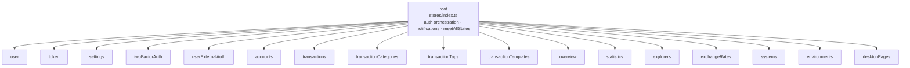
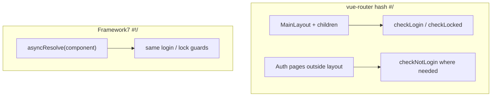
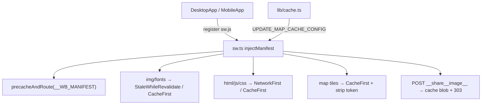

# Frontend architecture

Vue 3 + TypeScript. One `src/` tree builds **three** HTML entries; desktop and mobile share stores, models, and `*Base` logic.

## Entry points



| Entry | Shell | UI kit |
| --- | --- | --- |
| `src/desktop-main.ts` | `DesktopApp.vue` | Vuetify |
| `src/mobile-main.ts` | `MobileApp.vue` | Framework7 (iOS theme) |
| `src/index-main.ts` | redirect only | — |

## Logical layers



## Shared vs platform-specific



Pattern: business logic in `*Base.ts`; thin SFC templates per platform.

## Pinia store map



## API client (`lib/services.ts`)

```mermaid
sequenceDiagram
    participant Page as View / Store
    participant Ax as axios + interceptors
    participant US as userstate
    participant API as Backend /api

    Page->>Ax: method call
    Ax->>US: getCurrentToken()
    Ax->>API: Bearer + timezone headers
    alt token error 202001–202006 / 202012
        API-->>Ax: error
        Ax->>US: clearCurrentTokenAndUserInfo
        Ax->>Ax: location.reload()
    else success
        API-->>Ax: ApiResponse&lt;T&gt;
        Ax-->>Page: data
    end
```

Also supports: request blocking during token refresh, cancelable requests, per-operation timeouts (import/LLM/export longer than CRUD).

## Routing (guards)



App lock (PIN / WebAuthn) sits in `lib/userstate.ts` + unlock routes, independent of server JWT.

## PWA / service worker



## i18n

- Bundles under `src/locales/` (~20 languages).
- `vue-i18n` + large `locales/helpers.ts` for currency/date/numeral formatting.
- Desktop bridges locale/RTL into Vuetify; mobile uses separate LTR/RTL SCSS entries.

## Notable frontend choices

1. **Dual SPA, not responsive single app** — different navigation metaphors (sidebar vs F7 sheets).
2. **Hash history** — works behind simple static hosting / reverse proxies without rewrite rules.
3. **Stores own orchestration**; views stay thin via `*PageBase`.
4. **PWA share target** enables “share receipt image to app” on mobile.
