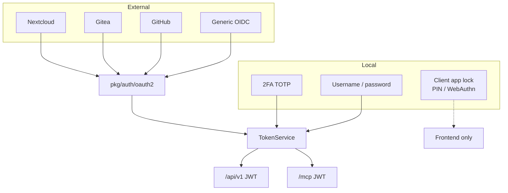
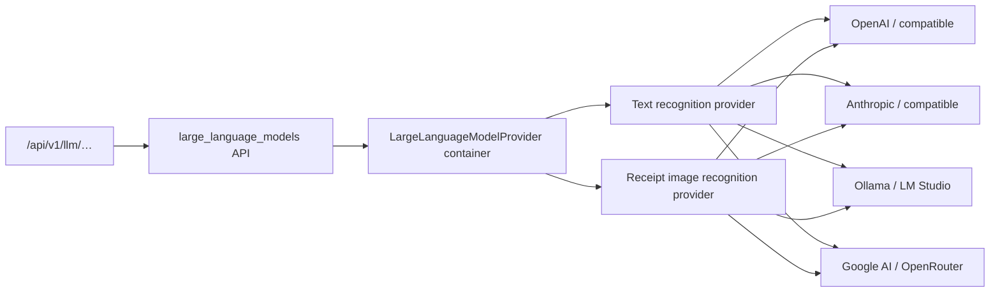
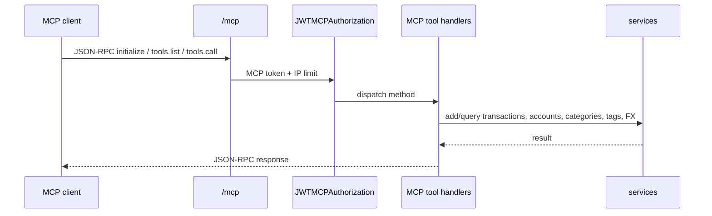
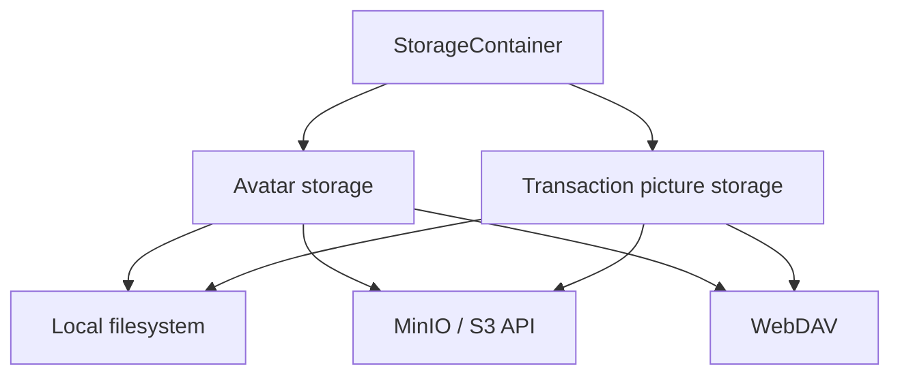
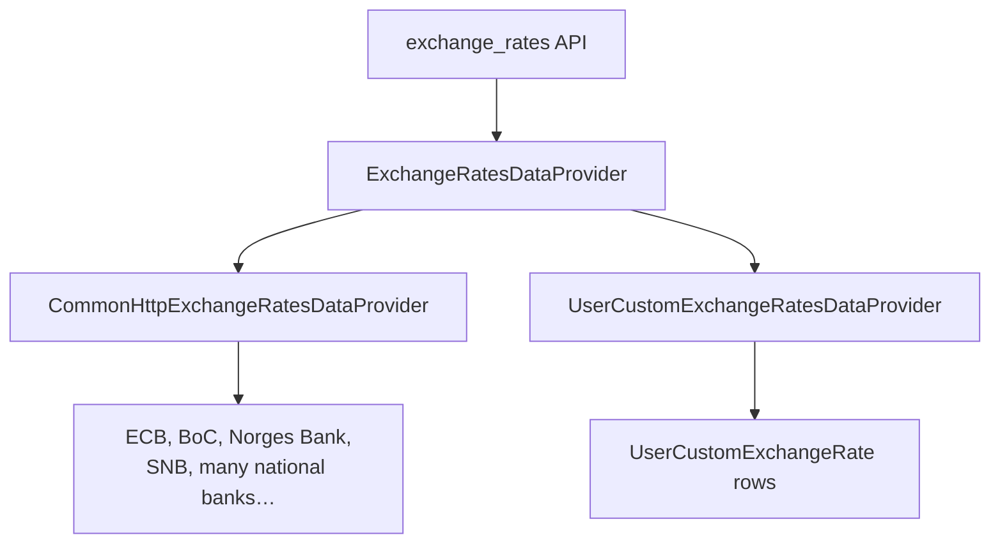
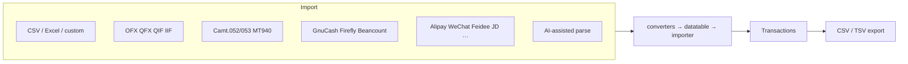
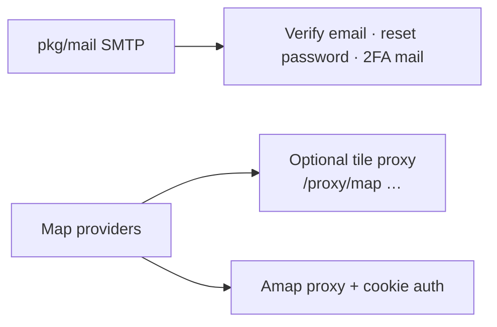
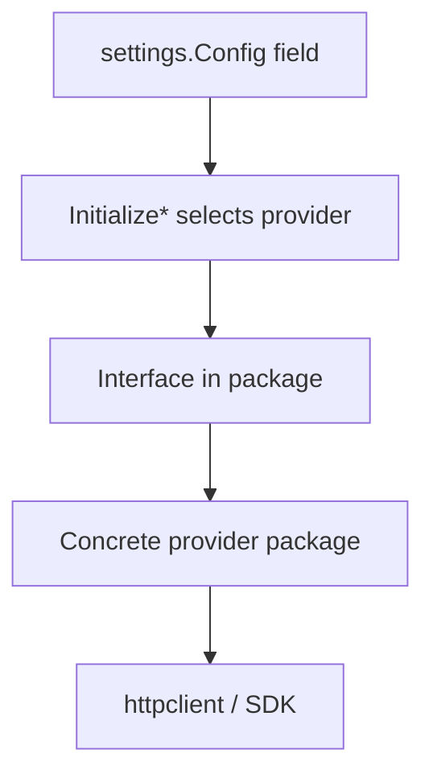

# Integrations

Config-driven **provider** interfaces. Operators pick implementations without code changes.

## Auth integrations

OAuth flow uses `/oauth2/login` + `/oauth2/callback` and short-lived callback tokens; PKCE supported where applicable.

## LLM

Used to draft transactions from free text or receipt images; still persisted through normal transaction services.

## MCP (Model Context Protocol)

Registered tools (representative):

- `add_transaction`
- `query_transactions`
- `query_all_accounts` / `query_all_accounts_balance`
- `query_all_transaction_categories`
- `query_all_transaction_tags`
- `query_latest_exchange_rates`

Schemas generated via `invopop/jsonschema` on Go types.

## Object storage

Interface: `Exists` / `Read` / `Save` / `Delete` (`pkg/storage`).

## Exchange rates

## Import / export formats

## Mail & maps

## Cross-cutting: duplicate checker

Used for:

- Login / sensitive action rate limiting
- OAuth state / form idempotency
- Cron singleton coordination across instances

## Integration decision style

Adding a new LLM, OAuth, FX, or storage backend means implementing the interface and wiring a config case — not changing API contracts.
