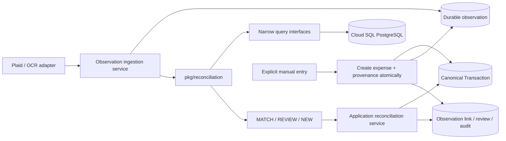
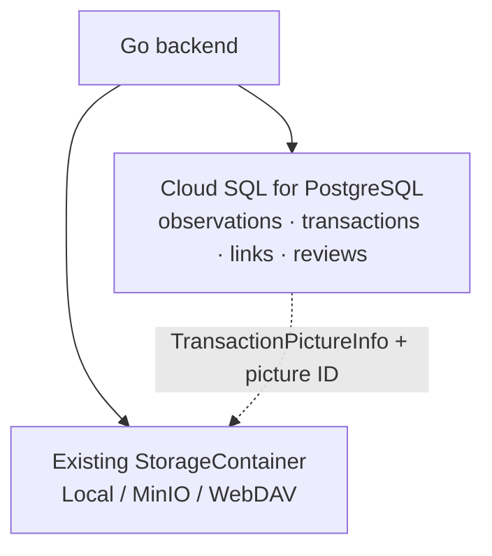
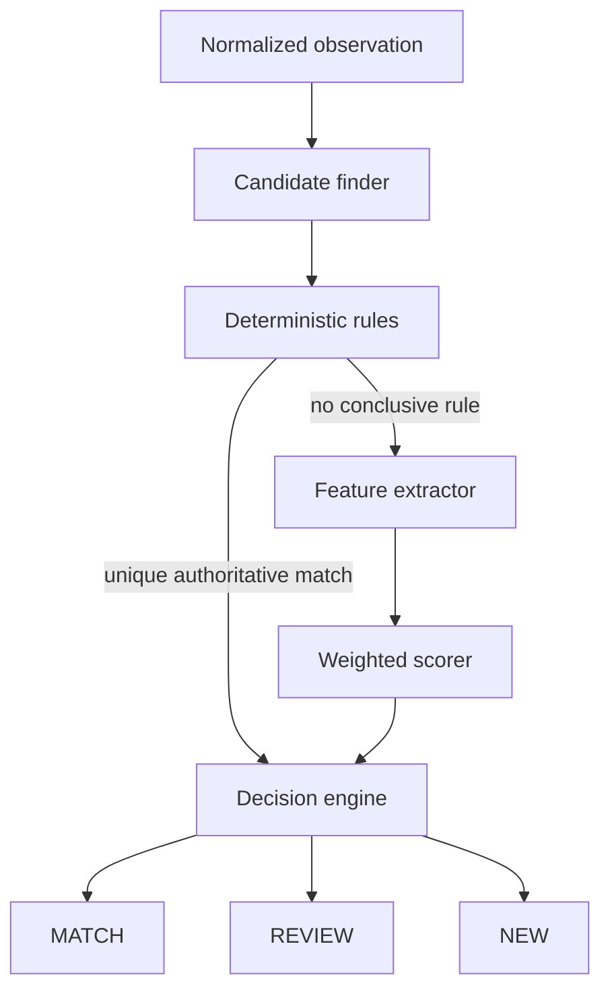

# Reconciliation Engine Design and Implementation Plan

Status: proposed MVP design; no implementation exists yet.

## 1. Purpose

The reconciliation engine decides whether one newly ingested Plaid or receipt/OCR observation describes an existing canonical transaction or a new one. It returns one of three outcomes:

- `MATCH`: attach the observation to one existing expense.
- `REVIEW`: preserve the observation and ask the user to choose because the evidence is conflicting or ambiguous.
- `NEW`: create a new canonical expense from the observation.

The MVP preserves observations from Plaid, receipt/OCR extraction, and manual entry. Manual entry follows a distinct default path: an explicit user action creates the canonical expense immediately and stores the manual input as linked provenance. Later Plaid or receipt observations can reconcile to that expense. Correctness takes priority over automation: uncertain cases go to review.

The engine remains an in-process Go module. It does not become a service and does not write transaction, observation, or review records itself.

## 2. Fit with the existing application

ezBookkeeping already separates HTTP adapters, services, models, and XORM-backed user data. Reconciliation should follow the same shape:



The existing `models.Transaction` remains the canonical financial record. For this MVP, only `TRANSACTION_DB_TYPE_EXPENSE` is eligible. Its amount continues to use `int64` minor units, its currency comes from the source account, and its time continues to use the existing transaction-time convention.

The current import models are transient conversion results, not source observations. They should not be reused as the durable reconciliation model because they discard source identifiers and raw provenance and assume that import immediately creates a transaction.

## 3. Domain model

### 3.1 Observation

An observation is an immutable report from one source. It records what that source said, even if the report is incomplete or later superseded.

Examples include a Plaid pending transaction, its later posted form, values extracted from a receipt image, and a user's expense entry. Multiple observations may describe the same canonical transaction.

A manual observation is provenance for the values the user submitted. By default it is stored in the same transaction that immediately creates and links the canonical expense; it is not sent through fuzzy reconciliation first. This preserves user intent while still allowing future source observations to match the manually created expense.

The source payload and source identity are immutable. Processing fields such as state, retry count, and the current link may change. If a source corrects financial content, ingest a new observation version and retain the earlier one rather than overwriting it.

### 3.2 Canonical transaction

A canonical transaction is the application's current belief about an expense that actually occurred. In the MVP this is an existing ezBookkeeping expense transaction plus a merchant/payee field added to the canonical model.

Canonical fields are not all equally authoritative. Explicit user edits outrank imported values. Attaching a new observation may fill a missing merchant, account, date precision, or receipt attachment, but must not silently overwrite a user-edited value. Field-merging policy belongs to the application layer, not the reconciliation engine.

### 3.3 Relationship and cardinality

- One observation can have at most one active canonical transaction link.
- One canonical transaction can have many linked observations.
- Link history is retained when a user corrects a prior decision.
- A review belongs to one observation and contains a snapshot of the alternatives considered.
- A reconciliation attempt records one engine run and its outcome for audit and diagnostics.

### 3.4 Required persistence models

The implementation should add five user-scoped models to `UserDataStore`:

| Model | Purpose | Important fields |
| --- | --- | --- |
| `FinancialObservation` | Immutable source report plus processing state | ID, UID, source, source connection ID, source observation ID, source version, expense kind, sanitized raw payload JSONB, normalized snapshot JSONB, receipt picture ID, status, received time, supersedes ID, retry metadata, timestamps |
| `ObservationExternalRef` | Indexed identifiers used by deterministic rules | UID, observation ID, namespace, value, relation type |
| `TransactionObservationLink` | Current and historical provenance link | UID, observation ID, transaction ID, active flag, link reason, actor, attempt ID, timestamps, revoked reason |
| `ReconciliationAttempt` | Auditable final engine result | UID, observation ID, engine/scoring version, decision, target ID, confidence, decision reason, compact evidence summary, error class, timestamps |
| `ReconciliationReview` | Work item for ambiguous observations | UID, observation ID, attempt ID, status, recommended target, alternatives snapshot, resolution, resolver, timestamps |

`FinancialObservation` should have a uniqueness constraint on `(uid, source, source_connection_id, source_observation_id, source_version)`. This is the ingestion idempotency key. Manual and OCR adapters generate a stable ID before submission; Plaid uses its source transaction identity plus a source version.

`TransactionObservationLink` should enforce at most one active link per observation with a PostgreSQL partial unique index, backed by the same application-transaction checks and per-user serialization described below.

Raw payloads should contain only fields required for provenance and reprocessing. Plaid observations retain a sanitized JSONB source payload sufficient to debug and rerun normalization, but never Plaid access tokens or other credentials. OCR observations retain the extraction result as JSONB and reference the original `TransactionPictureInfo` row by picture ID; image bytes do not belong in PostgreSQL.

### 3.5 Storage topology

Reconciliation uses the same Cloud SQL for PostgreSQL database as the rest of the backend. It does not introduce a second database, schema service, replica-owned data model, or reconciliation microservice. Logical separation comes from tables and module boundaries:

```text
Cloud SQL for PostgreSQL
├── financial_observation          raw/source evidence
├── transaction                    canonical expenses (existing model)
├── transaction_observation_link   observations linked to expenses
├── reconciliation_attempt         final decisions and compact evidence
├── reconciliation_review          unresolved user work
└── observation_external_ref       deterministic source relationships
```

In product language, an expense is the expense subset of the existing canonical `transaction` table; a separate `expenses` table is not required.

For example, a Plaid observation and receipt observation remain separate rows while both provenance links point to one canonical expense:

```text
financial_observation
obs_101  plaid        4217  CAD  Walmart
obs_102  receipt_ocr  4217  CAD  Walmart

transaction
exp_50   expense      4217       Walmart

transaction_observation_link
exp_50 -> obs_101
exp_50 -> obs_102
```

Receipt images reuse the project's existing transaction-picture path: `TransactionPictureService`, `TransactionPictureInfo`, and `StorageContainer`. The configured storage provider remains responsible for file bytes and may be the local filesystem, MinIO, or WebDAV. Reconciliation does not add another object-storage provider, bucket abstraction, or receipt-file table.

An OCR observation stores the existing transaction picture ID as its receipt reference. While the observation is pending or in review, that picture may still have `TransactionPictureNewPictureTransactionId` and must be excluded from unused-picture cleanup. When a `MATCH` or `NEW` decision is applied, use the existing transaction-picture attachment path to associate the picture with the canonical expense. The observation retains the picture ID as immutable provenance.



Configure `UserDataStore` and the reconciliation repositories to use the existing Cloud SQL database. The application can still use separate logical repository interfaces, but those interfaces must not imply separate persistence or distributed transactions. This keeps creation of a transaction and its provenance link atomic in one PostgreSQL transaction.

## 4. Normalized representation

Plaid and receipt/OCR adapters convert their own schemas into one versioned normalized observation before calling the engine. The manual adapter produces the same normalized provenance shape but links it during immediate canonical creation rather than calling fuzzy reconciliation. The engine never imports Plaid SDK types, OCR response types, or HTTP request DTOs.

| Field | Required? | Representation and rule |
| --- | --- | --- |
| Observation ID | Yes | Internal stable ID |
| User ID | Yes | Existing `int64` UID; never accepted from an untrusted payload |
| Kind | Yes | `expense` for MVP |
| Source | Yes | `plaid`, `receipt_ocr`, or `manual` |
| Source connection ID | When applicable | Identifies the Plaid item/account connection or other source instance |
| Source observation ID | Yes | Stable source ID; generated once for manual/OCR |
| Source version | Yes | Monotonic value or stable payload digest |
| Amount | Yes for automatic match | Non-negative `int64` minor units representing the expense total |
| Currency | Yes for automatic match | Uppercase ISO 4217 code |
| Merchant raw | Optional | Original text exactly as reported |
| Merchant normalized | Derived | Unicode-normalized, case-folded, punctuation/whitespace collapsed; legal suffixes are retained in MVP |
| Occurred time | Optional | UTC instant when the source has time precision |
| Local purchase date | Optional | Calendar date plus known UTC offset/time zone evidence |
| Date precision | Yes | `instant`, `day`, or `unknown` |
| Account hint | Optional | Internal account ID when already mapped |
| Payment-method hint | Optional | Non-secret network and last four digits or source account reference |
| External references | Optional | Namespaced identifiers and relationships, including pending/posted IDs |
| Source status | Optional | For example Plaid `pending` or `posted` |
| Explicit target | Optional | User-confirmed canonical transaction ID |
| Raw source payload | Yes | Sanitized JSONB sufficient for debugging and renormalization; never credentials or file bytes |
| Receipt file reference | For receipt source | Existing `TransactionPictureInfo.PictureId`; bytes are resolved through `TransactionPictureService` |
| Normalization version | Yes | Allows deterministic reprocessing after normalization changes |

Normalization rejects an invalid user, unsupported kind/source, malformed currency, out-of-range amount, or an observation with neither a usable amount nor a deterministic external relationship. Missing merchant, account, or exact time is allowed and lowers evidence coverage.

For canonical candidates, the repository returns a similarly normalized projection: transaction ID, user ID, kind, amount, account currency, merchant, transaction instant/local date, account ID, payment-method metadata if known, and linked external references. The engine does not receive the full persistence model.

## 5. Pipeline and component responsibilities



### Source normalizers

Owned by each integration adapter. They validate and map source data into the common representation and preserve raw provenance.

### Candidate finder

Queries plausible existing expenses through a narrow repository interface. It favors recall and returns a bounded, deterministically ordered set.

### Deterministic rule evaluator

Evaluates authoritative relationships before fuzzy matching. It can return a unique target, a conflict, or no conclusion. It must never resolve contradictory authoritative evidence by score.

### Feature extractor

Produces independent named feature values and conflict flags for each candidate. It contains no weights or outcome thresholds.

### Scorer

Combines feature values according to a versioned scoring policy. It has no database access and does not choose `MATCH`, `REVIEW`, or `NEW`.

### Decision engine

Examines deterministic evidence, the best and second-best scored candidates, score margin, feature coverage, and conflicts. It returns a result without persistence side effects.

### Application reconciliation service

Persists observations, invokes the engine, records attempts, serializes and applies decisions, creates reviews, and performs field merging. This component owns transactions and retries.

## 6. Candidate-selection strategy

The repository first fetches active canonical expense transactions satisfying all hard filters:

1. Same user.
2. Expense type.
3. Same currency.
4. Transaction date within seven calendar days before or after the observation's local purchase date. When only an instant is available, calculate the range using the observation offset. If date is unknown, fuzzy candidate search is not allowed.
5. Absolute amount difference no greater than the larger of 100 minor units or 5% of the observed amount.

The amount tolerance is for candidate recall, not permission to auto-match. Currency disagreement is a hard conflict and must never be converted.

Candidates are ordered by:

1. Exact internal account match.
2. Exact amount.
3. Smallest amount difference.
4. Smallest date distance.
5. Transaction ID for stable ordering.

Return at most 50 candidates. If more than 50 candidates satisfy the hard filters, report candidate-set overflow to the decision engine and return `REVIEW`; do not silently truncate and choose a match.

The current transaction indexes already support user/type/time range retrieval. The first implementation should query that bounded date range and perform amount and account ranking in the repository. Add a new database index only after query-plan and representative-volume tests show it is needed; avoid an amount-specific index prematurely.

Deterministic lookups by external reference run independently of the fuzzy date/amount query. A source-confirmed relationship must still be found when a posting date or settled amount falls outside fuzzy tolerances.

## 7. Deterministic rule system

Rules run in the following precedence order and emit named evidence:

1. **Explicit user-confirmed target.** Match only if the target exists, belongs to the same user, and is an active expense. Invalid or conflicting explicit targets produce `REVIEW` and an integrity alert.
2. **Existing active observation link.** Reprocessing the same observation returns its linked transaction. This makes retries stable.
3. **Exact source identity already linked.** A matching namespaced source transaction identifier resolves to the previously linked transaction.
4. **Plaid pending-to-posted relationship.** If Plaid identifies the pending transaction replaced by the posted transaction, follow the pending observation's active canonical link.
5. **Previously established source relationship.** Follow a stored source relationship only when it resolves to exactly one active canonical expense.

Every deterministic target is validated against UID and expense type. Amount, currency, or account disagreement does not redirect the result to a different candidate. Instead:

- Expected Plaid pending-to-posted amount changes are accepted only within the candidate amount tolerance and with matching currency/account.
- Any larger amount difference, currency conflict, target deletion, or two authoritative references resolving to different transactions yields `REVIEW`.
- Multiple records for an identifier that should be unique yield `REVIEW` plus an operational integrity error.

Deterministic rules are small ordered implementations behind one evaluator. The MVP does not include a general rules DSL or user-authored rules.

## 8. Matching features

Each fuzzy candidate receives the following independent features in the range 0 to 1, plus explicit conflict flags:

| Feature | Calculation | Missing evidence |
| --- | --- | --- |
| Amount similarity | `1 - (absolute difference / candidate tolerance)`, clamped to 0–1 | Observation without amount cannot use fuzzy matching |
| Merchant similarity | Exact normalized string = 1; otherwise normalized character-trigram Dice similarity | 0 and marked unavailable |
| Date similarity | Same local date = 1; one day = 0.8; two = 0.55; three = 0.3; four to seven = 0.1 | 0 and marked unavailable |
| Account/payment match | Internal account ID match = 1; mapped source account or network+last-four match = 0.8; unknown = unavailable; known mismatch = conflict | 0 and marked unavailable |
| Currency match | 1 after candidate filtering | Known mismatch is a hard conflict |

Merchant normalization should be deterministic and locale-agnostic for the MVP: Unicode normalization, case folding, punctuation-to-space, and whitespace collapse. Do not add learned aliases, embeddings, an LLM, or locale-specific merchant databases.

Feature output includes the raw values used to derive the feature, availability, and a short machine-readable evidence code. Sensitive payment details must be masked in evidence.

## 9. Initial scoring strategy

Use a versioned weighted score:

| Feature | Weight |
| --- | ---: |
| Amount | 0.45 |
| Merchant | 0.20 |
| Date | 0.20 |
| Account/payment method | 0.15 |

Currency is a hard gate rather than a weighted feature. Missing features contribute zero; weights are not renormalized. This prevents an observation with only one matching field from receiving artificial high confidence.

Evidence coverage is the sum of weights for available features. A fuzzy automatic match requires at least 0.80 coverage, exact amount, usable date evidence, and no conflict flags. Thus an observation may omit either merchant or account evidence, but not both.

The result stores the scoring-policy version, feature values, weights, and final score. Threshold or weight changes therefore affect future attempts without making old decisions impossible to explain.

## 10. Decision rules and ambiguity handling

Decision order is intentional:

1. Invalid normalized input returns a processing error, not `NEW`.
2. Contradictory deterministic evidence returns `REVIEW`.
3. One valid deterministic target returns `MATCH` with deterministic confidence and bypasses fuzzy scoring.
4. Candidate overflow returns `REVIEW`.
5. No fuzzy candidates returns `NEW`.
6. Otherwise rank candidates by score, then stable candidate order.

For fuzzy results:

- Return `MATCH` when the best score is at least 0.85, the margin over the second-best score is at least 0.15 (or there is no second candidate), coverage is at least 0.80, amount is exact, date evidence is available, and no conflicts exist.
- Return `REVIEW` when the best score is at least 0.65 but the automatic-match conditions are not all met.
- Return `REVIEW` whenever two candidates score at least 0.65 and their margin is below 0.15, even if the best candidate exceeds 0.85.
- Return `REVIEW` when a known account/payment mismatch accompanies an otherwise plausible score of at least 0.65.
- Return `NEW` when all candidates score below 0.65 and there is no deterministic conflict.

Threshold equality is inclusive. Scores are calculated at full precision and rounded only for display. Candidate ordering and tie handling must be deterministic.

These constants are package configuration, not operator settings, for the MVP. Changing them requires a new scoring-policy version and regression evaluation against the labeled fixture set.

## 11. Reconciliation result

The engine result contains:

| Field | Meaning |
| --- | --- |
| Decision | `MATCH`, `REVIEW`, or `NEW` |
| Observation ID | Input identity |
| Target transaction ID | Present only for `MATCH`; optional recommendation for `REVIEW` is separate |
| Confidence | Deterministic confidence or best fuzzy score; not presented as a probability |
| Decision reason | Stable machine-readable reason code |
| Evidence | Deterministic evidence, feature values, coverage, conflicts, and scoring version |
| Alternatives | Ordered candidate IDs, scores, and evidence summaries, capped at 10 in the returned view |
| Candidate count | Total candidates considered |
| Engine version | Reproducibility and audit |

The result must not contain a transaction object to persist, an XORM session, or instructions that mutate records. `NEW` means that the application may create a transaction; it is not itself a created transaction.

Candidate matches are ephemeral engine output, not durable domain entities. Do not add a candidate-match table. Persist only the compact evidence needed to explain a final `MATCH` or `NEW` decision: the selected target when applicable, best and second-best scores, their margin, decisive features/conflicts, candidate count, and policy version. A `REVIEW` persists its bounded alternatives because those candidates are required for future user action. Fresh reconciliation always recomputes candidates against current canonical data.

## 12. Repository and module boundaries

Create `pkg/reconciliation` for normalization-independent matching logic. It owns normalized input/projection types, rules, feature extraction, scoring, and decision policy.

The package depends on narrow behavior-oriented interfaces:

- Find fuzzy expense candidates for one user and normalized search envelope.
- Resolve active canonical targets by observation ID or external reference.
- Load the canonical expense identified by an explicit relationship.

Implement those interfaces in the application/service integration using `UserDataStore`. Do not expose XORM sessions, SQL fragments, or `models.Transaction` to the engine.

Persistence models remain in `pkg/models`, database synchronization remains in `cmd/database.go`, and orchestration belongs in `pkg/services`. Source-specific Plaid and OCR adapters stay outside `pkg/reconciliation`.

All repository methods require UID explicitly and repeat UID predicates in database queries. A target found under a different user is treated as not found and logged as an integrity/security event.

## 13. Applying decisions

The application layer applies a result while persisting its final attempt. Application is serialized by user using the existing cross-instance duplicate-checker facility with a short reconciliation key. Once the key is held, rerun reconciliation immediately so a transaction created by another observation can become a candidate.

Apply the final result in one `UserDataStore.DoTransaction` transaction:

### `MATCH`

1. Verify the observation is still unlinked or already linked to the same target.
2. Verify the target is still an active expense for the user.
3. Create the active provenance link.
4. Apply the conservative field-merge policy and attach a receipt image if applicable.
5. Mark the observation reconciled and close any open review.

### `REVIEW`

1. Create or update the single open review for the observation.
2. Store the final attempt and the review's bounded alternatives/evidence snapshot. Do not create general candidate rows.
3. Mark the observation awaiting review; do not create or modify a canonical transaction.

User resolution has two actions in the MVP:

- Confirm a target: create an explicit-user link and apply `MATCH` atomically.
- Create separate expense: create a new canonical expense, link the observation with a user-confirmed-new reason, and close the review.

The closed resolution prevents later retries from reconsidering that observation unless the user explicitly reopens it.

### `NEW`

1. Recheck that the observation remains unlinked.
2. Create a canonical expense through the existing transaction service's validated creation path.
3. Populate merchant and other eligible fields from the observation.
4. Create the active provenance link.
5. Mark the observation reconciled.

If transaction creation and link creation cannot share the same XORM transaction through the current service boundary, refactor the transaction service to expose an application-internal session-aware operation. Do not accept a gap in which a transaction can commit without its observation link.

The duplicate-checker lock limits cross-instance races but is not the source of correctness. Observation idempotency, same-transaction state checks, and rerunning the engine while serialized make retry behavior safe.

### Explicit manual entry

Manual entry bypasses the three-way engine decision by default because the user has already expressed the intent to create an expense:

1. Validate and create the canonical expense through the existing transaction service.
2. Store a sanitized manual observation containing the submitted financial fields.
3. Create an active provenance link with reason `manual_create`.
4. Commit the expense, observation, and link in the same PostgreSQL transaction.

This expense is immediately available as a candidate when Plaid or receipt/OCR evidence arrives. An optional future “link to existing expense” manual workflow may invoke reconciliation, but it is not part of the MVP.

## 14. Canonical field merge policy

The MVP uses conservative, field-specific rules:

- Never change amount or currency during automatic `MATCH`.
- Never replace a user-edited merchant, date, account, category, tags, or comment.
- Fill a missing merchant from a linked observation; prefer manual, then receipt, then posted Plaid, then pending Plaid.
- Attach a receipt image without replacing existing images and within the current picture-count limit.
- A Plaid posted observation may supply a more precise date only when the canonical field was source-derived and the change does not cross the fuzzy date window.
- Conflicting account, amount, or currency data remains visible as provenance and sends the item to review rather than being merged.

To enforce user-edited precedence later, canonical fields need origin metadata. For MVP, record field origins for reconciliation-populated merchant/date/account fields in the link/attempt evidence and treat pre-existing canonical values as user-owned. A general per-field provenance framework is deferred.

## 15. Failure, retry, and concurrency behavior

Failures are classified as follows:

| Failure | Behavior |
| --- | --- |
| Invalid source input | Persist sanitized failure metadata when safe; reject without retry |
| Temporary database/object-store error | Leave observation pending; exponential retry with jitter |
| Engine bug or invariant violation | Mark processing error, retain input, alert/log, no automatic `NEW` |
| Candidate overflow | Create review; not a retryable error |
| Missing deterministic target | Review if a relationship existed; otherwise retry only if the source is still settling |
| Apply-time state change | Roll back, release serialization key, rerun from candidate selection |
| Duplicate delivery | Return the already stored observation/result; do not create another transaction |

Automatic retries use bounded exponential delays and stop after five attempts. Exhaustion creates an operationally failed observation visible for manual retry; it does not create a financial review unless the engine produced `REVIEW`.

Plaid pending observations may reconcile immediately when a strong candidate exists. When the posted observation arrives, the pending-to-posted relationship is evaluated first. Preserve both observations, mark the pending observation superseded, and link both to the same canonical transaction. Do not delete or rewrite the pending observation.

## 16. Provenance and audit requirements

For every observation and decision, retain:

- Source, stable source identity, source version, receipt picture ID, and received time.
- Immutable normalized snapshot and normalization version.
- Engine and scoring-policy version.
- Complete deterministic evidence and conflicts.
- For `MATCH` and `NEW`, compact final evidence: selected candidate when applicable, best/second-best scores, margin, decisive feature values/conflicts, candidate count, and selected threshold path.
- For `REVIEW`, the bounded alternatives, their display evidence and scores, and the candidate count needed for resolution.
- Applying actor: automatic system, user ID, or administrative repair.
- Link creation/revocation and review resolution history.
- Error class and retry history, excluding secrets and unmasked payment data.

Logs may include internal observation/transaction IDs and reason codes, but raw receipt text, raw Plaid payloads, merchant/payment details, and access credentials must not be written to application logs.

Audit records follow the existing user's financial-data retention lifecycle. A normal transaction deletion does not erase its observation/link history; the link becomes historically resolvable and the observation is surfaced for review if reprocessing is requested. Full user-data deletion removes all of the user's reconciliation data.

Full candidate sets are not audit records and are not retained. A historical run is explained by its versioned normalized input, compact decision evidence, and engine/scoring versions; rerunning candidate search may differ if canonical data has since changed.

## 17. Testing strategy

### Unit tests

- One table-driven suite for every normalizer, including Unicode merchant text, currency casing, minor-unit boundaries, missing fields, and source versions.
- Candidate envelope tests at exact amount/date/tolerance boundaries and overflow.
- Ordered deterministic-rule tests, including conflicting references and Plaid pending-to-posted changes.
- Feature tests with fixed merchant, date, amount, and account fixtures.
- Scoring tests that prove missing evidence is not renormalized.
- Decision matrix tests at 0.65/0.85 thresholds and 0.15 margin boundaries.
- Stable sorting and repeatability tests.
- Fuzz tests for merchant normalization and feature extraction to ensure no panic or out-of-range score.

### Repository integration tests

Run persistence and concurrency integration tests against PostgreSQL, matching the Cloud SQL production target:

- UID isolation and soft-deleted transaction exclusion.
- Currency derived from the correct account.
- Date-window and candidate-limit behavior.
- External-reference uniqueness and deterministic lookup.
- Transaction/observation/link/review atomicity.
- Duplicate deliveries and concurrent observation application.
- Partial uniqueness for active links and JSONB raw/normalized snapshots.
- Existing transaction-picture reference persistence without image bytes in PostgreSQL.
- Pending/review receipt pictures are excluded from unused-picture cleanup and attach correctly after `MATCH` or `NEW`.

Reuse the existing storage-provider test coverage for Local, MinIO, and WebDAV. Reconciliation integration tests should use the configured test storage and cover missing pictures and retryable storage failures. Pure engine tests remain storage-independent.

### End-to-end scenarios

- Manual expense followed by matching posted Plaid observation produces one expense.
- Receipt followed by Plaid produces one expense with both provenance links and receipt attachment.
- Plaid pending followed by posted preserves both observations and one expense.
- Two same-day, same-amount expenses with similar merchants produce `REVIEW`.
- Same amount and merchant in different currencies never match.
- Exact external ID with a material amount conflict produces `REVIEW`.
- A retry after an apply-time failure produces no duplicate expense.
- User chooses an alternative candidate or explicitly creates a separate expense.

### Golden decision corpus

Maintain a small, sanitized, hand-labeled fixture corpus of clear matches, ambiguous pairs, and clear new expenses. Record expected decision, reason, and candidate order. Any scoring-policy change must run against this corpus and intentionally update its policy version.

## 18. Observability

Add structured counters and timings without financial values:

- Observations ingested by source and status.
- Decisions by source, decision, reason, and policy version.
- Candidate count and engine latency distributions.
- Review creation and user resolution rates.
- Retry/error counts by class.
- Automatic matches later revoked by users; this is the primary false-positive signal.

Do not make metrics a prerequisite for a decision. If metric emission fails, reconciliation continues.

## 19. MVP boundaries

Included:

- Expenses only.
- Plaid, receipt/OCR, and manual observations.
- Durable observation provenance.
- Plaid pending-to-posted and exact external relationships.
- Deterministic plus weighted fuzzy scoring.
- One-to-many observation-to-canonical provenance.
- Manual review resolution and safe retry behavior.

Explicitly deferred:

- Income, refunds, chargebacks, split transactions, and transfers.
- Cross-currency matching or exchange-rate inference.
- Partial receipt totals, tip/tax line-item reconciliation, and many-to-many matching.
- ML, embeddings, LLM matching, learned merchant aliases, and per-user trained weights.
- A user-configurable rule language or thresholds.
- Batch/global optimization across an entire statement.
- Extraction to a microservice or event-bus architecture.
- Automatic correction of canonical values and a general per-field provenance system.
- Review UI polish beyond the minimum candidate comparison and resolve actions.

## 20. Stacked PR delivery protocol

Implement the reconciliation engine as a stack of small, independently reviewable pull requests. The feature is too large for one PR.

Before writing implementation code, inspect the repository at the current target revision and produce the proposed PR stack. The task backlog in [Reconciliation Engine Task Backlog](./reconciliation-engine-tasks.md) is the starting point, but it is not automatically the final PR stack: group or split tasks according to actual repository boundaries, dependencies, and diff size discovered during inspection.

### PR constraints

- Every PR must build and have a meaningful testable outcome on its own.
- Keep database, configuration, and API changes backward-compatible where possible. Additive schema changes must land before code depends on them, and old clients must continue to work unless an incompatibility is explicitly approved.
- Avoid unrelated refactors, formatting churn, dependency upgrades, and opportunistic cleanup.
- Every PR must include the unit, integration, or end-to-end tests appropriate to its change.
- Target fewer than 800 changed lines per PR, excluding generated files and fixture data. A larger PR requires a concrete explanation in the stack plan and PR description.
- Keep commits and PRs dependency-ordered. Later PR branches must be based on the immediately preceding PR branch, not on `main`.
- Do not merge any PR as part of the implementation workflow.

### Required workflow

1. Inspect the current repository and produce the complete proposed PR stack before coding.
2. Create PR 1's branch from `main`.
3. Create PR 2's branch from PR 1's branch.
4. Continue the same pattern: every later PR branches from its direct predecessor.
5. Run the full relevant test suite at every layer, including inherited behavior from earlier PRs.
6. Self-review each PR's diff against its parent branch, not against `main`.
7. Prepare a clear title and description for every PR. Each description must state scope, parent branch, behavior change, schema/API compatibility, tests run, risks, and anything deliberately deferred.
8. Leave all PRs unmerged for human review.

The pre-coding stack plan must list, for each PR:

- Sequence number, proposed branch, and parent branch.
- PR title and objective.
- Included reconciliation task IDs.
- Expected files/packages and public contracts affected.
- Database, configuration, or API compatibility impact.
- Tests to add and the full relevant suite to run.
- Expected diff size and justification if it may exceed 800 changed lines.
- Risks, rollback boundary, and dependency on earlier PRs.

If repository inspection or implementation exposes an architectural choice with major downstream consequences, stop before coding past that decision. Explain the viable alternatives, their migration and compatibility effects, and the recommended choice, then wait for direction. Examples include changing the canonical transaction model beyond an additive merchant field, replacing the current database synchronization strategy, introducing a new storage provider, changing the observation-to-transaction cardinality, or altering the manual-entry lifecycle.

## 21. Implementation sequence

Each phase should be complete and testable before work advances to the next. Its PRs remain unmerged unless the user later authorizes merging.

### Phase 1: Persistence and contracts

1. Add observation, external-reference, link, attempt, and review models and database synchronization.
2. Add the canonical merchant field and define source/user ownership behavior.
3. Add PostgreSQL JSONB fields, uniqueness constraints, and the active-link partial unique index in the existing Cloud SQL database.
4. Integrate receipt provenance with the existing transaction-picture service and protect observation-referenced pictures from unused-picture cleanup.
5. Define normalized observation, candidate projection, result, evidence, and repository contracts in `pkg/reconciliation`.
6. Add persistence constraints and user-scoped repository integration tests.

Exit criterion: observations can be stored and retrieved idempotently, but no ingest path uses reconciliation yet.

### Phase 2: Pure engine

1. Implement deterministic merchant normalization.
2. Implement candidate orchestration against a fake repository.
3. Implement ordered deterministic rules.
4. Implement feature extraction, scoring policy v1, and the decision matrix.
5. Build the golden decision corpus and unit/fuzz tests.

Exit criterion: the pure engine produces stable, fully explained results for all fixture scenarios and performs no writes.

### Phase 3: Application orchestration

1. Implement XORM-backed candidate and relationship repositories.
2. Add the service that persists attempts and atomically applies `MATCH`, `REVIEW`, and `NEW`.
3. Add per-user serialization, apply-time rerun, bounded retry, and idempotency behavior.
4. Add review resolve/reopen service operations and concurrency tests.

Exit criterion: synthetic observations can safely reconcile into canonical expenses with no duplicate creation under retry/concurrency tests.

### Phase 4: Source adapters

1. Extend manual expense creation to atomically store and link its provenance observation; do not send default manual creation through fuzzy reconciliation.
2. Route receipt/OCR results through a receipt normalizer and preserve the image/raw extraction provenance.
3. Add Plaid normalization, stable identity, account mapping, pending/posted external references, and webhook retry handling.
4. Roll out each source behind a feature flag and compare shadow decisions before enabling automatic application.

Exit criterion: all three sources use the same observation/provenance model, Plaid and receipt/OCR use the reconciliation engine, manual creation immediately produces a linked canonical expense, and pending-to-posted Plaid scenarios produce one canonical expense.

### Phase 5: Review surface and rollout

1. Add the minimum API and shared frontend store/model support for listing reviews, comparing evidence, selecting a candidate, or creating a separate expense.
2. Add thin desktop and mobile review views following the existing shared-base pattern.
3. Add metrics, dashboards/log queries, and an operator-visible failed-observation path.
4. Start in shadow mode, then enable `REVIEW`/`NEW`, and enable automatic `MATCH` last after fixture and shadow-result review.

Exit criterion: users can resolve every non-automatic outcome, operations can diagnose failures without inspecting sensitive payloads, and the automatic-match revocation rate is tracked.

## 22. Acceptance criteria

The MVP design is implemented successfully when:

- Re-delivering the same source observation never creates another canonical expense.
- A receipt, manual entry, and Plaid record for the same purchase can all link to one expense.
- An explicit manual entry creates its canonical expense and linked provenance atomically without waiting for reconciliation.
- A fuzzy match cannot occur across users, currencies, or unsupported transaction types.
- Two plausible high-scoring candidates result in review instead of arbitrary selection.
- Every historical result is explainable from its versioned normalized snapshot, compact final evidence, and engine/scoring versions.
- Candidate matches have no permanent table; only compact final evidence and review alternatives are persisted.
- The engine package has no XORM, Plaid, OCR-provider, Gin, or transaction-write dependency.
- Applying a result is atomic with its provenance link.
- Reconciliation tables and canonical transactions live in the same Cloud SQL PostgreSQL database.
- Receipt image bytes use the project's configured transaction-picture storage, while PostgreSQL stores the existing picture metadata and observation reference.
- A transient failure or process restart cannot convert uncertainty into `NEW` or duplicate a transaction.
- Plaid pending-to-posted relationships are used before fuzzy scoring.
- Existing user-entered canonical values are never silently overwritten by automatic reconciliation.
