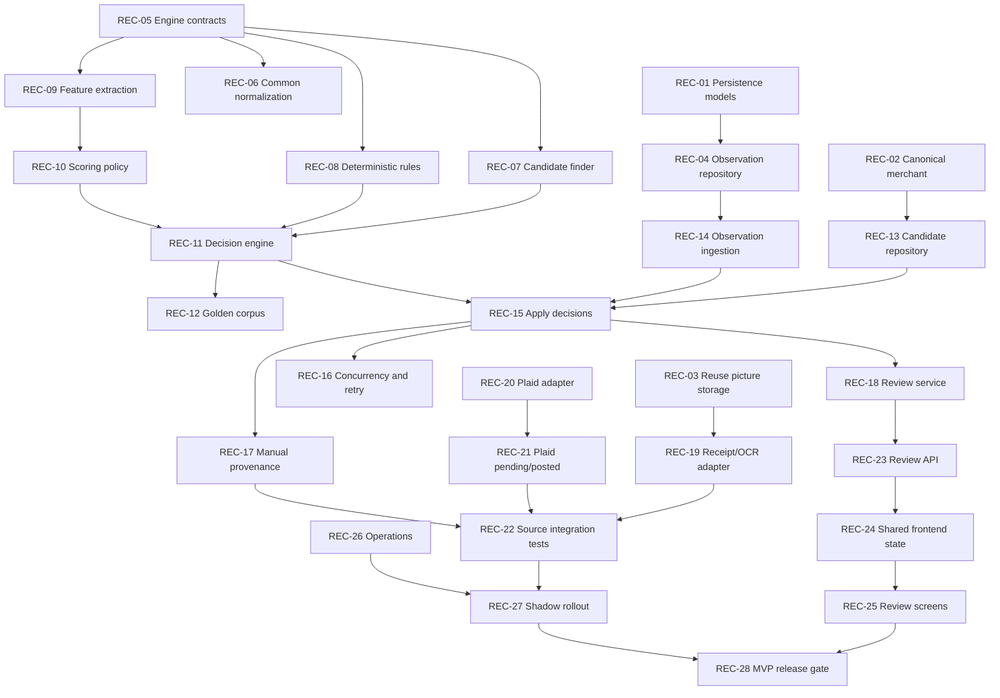

# Reconciliation Engine Task Backlog

Status: proposed implementation backlog. This document contains planning only; it does not authorize or include production code.

Source design: [Reconciliation Engine Design and Implementation Plan](./reconciliation-engine-plan.md)

## Working rules

- Complete tasks in dependency order; a task should normally fit in one reviewable pull request.
- Tests listed in a task are part of that task, not follow-up cleanup.
- Keep reconciliation tables in the existing Cloud SQL PostgreSQL database.
- Keep receipt image bytes in the project's existing transaction-picture storage and only picture metadata/references in PostgreSQL.
- Do not add a candidate-match table.
- Do not enable automatic `MATCH` until shadow-mode results have been reviewed.
- Income, refunds, transfers, split matching, cross-currency matching, ML, and LLM matching remain out of scope.

## Dependency overview

## Milestone 1: Storage and contracts

### REC-01 — Add reconciliation persistence models

Dependencies: none.

Deliverables:

- Add user-scoped persistence models for financial observations, external references, transaction-observation links, reconciliation attempts, and reconciliation reviews.
- Store sanitized raw and normalized observation snapshots as PostgreSQL JSONB.
- Add source-idempotency uniqueness and a partial unique index allowing at most one active link per observation.
- Register the models with the existing database initialization/synchronization path.
- Do not add a candidate-match model or table.

Done when:

- Schema tests prove idempotency, UID isolation, active-link uniqueness, and review/attempt relationships.
- Reconciliation data is created in the same PostgreSQL database as canonical transactions.
- A schema inspection confirms there is no candidate table and no receipt binary column.

### REC-02 — Add canonical merchant support

Dependencies: none.

Deliverables:

- Add a canonical merchant/payee field to expense transactions.
- Define how existing API responses, imports, exports, and transaction edits expose or preserve the field.
- Treat pre-existing or user-edited merchant values as user-owned.

Done when:

- Existing transactions remain readable after the schema change.
- Creating and editing an expense preserves the merchant value.
- Reconciliation cannot silently replace a user-owned merchant.

### REC-03 — Reuse transaction-picture storage for receipt provenance

Dependencies: none.

Deliverables:

- Reuse `TransactionPictureService`, `TransactionPictureInfo`, and the configured `StorageContainer` for receipt images.
- Store the existing picture ID on the observation as immutable receipt provenance.
- Protect pictures referenced by pending or review observations from unused-picture cleanup while their transaction ID is still the new-picture sentinel.
- Attach the picture through the existing transaction-picture path when `MATCH` or `NEW` is applied.
- Keep receipt bytes out of PostgreSQL and application logs.

Done when:

- Reconciliation tests cover an existing picture, missing picture, retryable storage failure, cleanup protection, and final transaction attachment.
- The configured Local, MinIO, or WebDAV provider remains transparent to reconciliation.
- No new storage provider, receipt bucket abstraction, or binary database column is introduced.

### REC-04 — Add observation persistence repository

Dependencies: REC-01.

Deliverables:

- Add user-scoped operations to insert or return an observation idempotently.
- Add operations for external references, processing state, attempts, active/historical links, and reviews.
- Ensure repository methods require UID explicitly and never return cross-user records.

Done when:

- Redelivering the same source version returns the existing observation.
- A changed source version creates a new immutable observation and retains the old version.
- Sanitized Plaid/OCR payloads can be loaded for renormalization without credentials or file bytes.

### REC-05 — Define pure reconciliation contracts

Dependencies: none.

Deliverables:

- Define versioned normalized observation and canonical-candidate projections.
- Define external-reference, deterministic evidence, feature, scored candidate, conflict, result, and alternative shapes.
- Define narrow read-only interfaces for fuzzy candidates and deterministic target resolution.
- Keep Gin, XORM, Plaid, OCR-provider, object-storage provider, and transaction-write types outside these contracts.

Done when:

- The package can be tested entirely with in-memory fakes.
- `MATCH`, `REVIEW`, and `NEW` results carry reason codes, compact evidence, policy version, and engine version.
- The contracts cannot directly mutate or persist a canonical transaction.

## Milestone 2: Pure reconciliation engine

### REC-06 — Implement common normalization rules

Dependencies: REC-05.

Deliverables:

- Normalize expense amount, ISO currency, source identity, time/date precision, account hints, and namespaced external references.
- Normalize merchant text using Unicode normalization, case folding, punctuation-to-space, and whitespace collapse.
- Version the normalization behavior.
- Reject invalid source, UID, currency, amount, or unusable evidence without converting the input into `NEW`.

Done when:

- Table-driven tests cover boundary amounts, currency casing, missing optional fields, Unicode merchants, and stable source versions.
- Fuzz tests show normalization does not panic or emit invalid values.

### REC-07 — Implement candidate finding and bounds

Dependencies: REC-05.

Deliverables:

- Apply same-user, expense-type, currency, seven-day, and amount-tolerance filters.
- Rank by account match, exact amount, amount difference, date difference, and stable transaction ID.
- Cap candidates at 50 and report overflow rather than silently truncating.
- Keep external-reference lookups independent of fuzzy filters.

Done when:

- Boundary tests cover exactly seven days, 100 minor units, 5%, stable ties, no date, and overflow.
- No candidate can cross user, currency, or transaction-type boundaries.

### REC-08 — Implement deterministic reconciliation rules

Dependencies: REC-05.

Deliverables:

- Implement ordered rules for explicit user target, existing active link, exact source identity, Plaid pending-to-posted, and established source relationships.
- Validate target UID, active state, expense type, currency, account, and permitted settled-amount change.
- Return a conflict instead of choosing when authoritative relationships disagree.

Done when:

- Every precedence path and conflict path has a named evidence code and test.
- Duplicate authoritative identifiers produce `REVIEW` plus an integrity signal.
- Deterministic rules do not fall back to a different fuzzy candidate after a material conflict.

### REC-09 — Implement feature extraction

Dependencies: REC-05, REC-06.

Deliverables:

- Extract independent amount, merchant, date, account/payment, and currency evidence.
- Implement character-trigram Dice similarity for normalized merchant strings.
- Report feature availability separately from a zero score.
- Emit explicit account/payment and currency conflicts with masked evidence.

Done when:

- Feature tests cover exact, partial, missing, and conflicting inputs.
- All numeric features are deterministic and remain in the range 0–1.
- Feature extraction contains no thresholds that select a final decision.

### REC-10 — Implement scoring policy v1

Dependencies: REC-09.

Deliverables:

- Apply weights: amount 0.45, merchant 0.20, date 0.20, account/payment 0.15.
- Treat currency as a hard gate.
- Treat missing features as zero without renormalizing weights.
- Calculate evidence coverage and record scoring-policy version.

Done when:

- Exact expected scores are covered by table-driven tests.
- Tests prove observations with insufficient evidence cannot gain artificial confidence.
- Full-precision calculation and display-only rounding are separate.

### REC-11 — Implement decision policy

Dependencies: REC-07, REC-08, REC-10.

Deliverables:

- Apply invalid-input, deterministic-conflict, deterministic-match, overflow, no-candidate, and fuzzy-decision precedence.
- Require score 0.85, margin 0.15, coverage 0.80, exact amount, date evidence, and no conflicts for fuzzy `MATCH`.
- Use 0.65 as the review floor and make ambiguous high-scoring pairs return `REVIEW`.
- Return compact evidence; keep full candidates in memory.

Done when:

- Tests cover both sides and exact equality of every threshold.
- Candidate order and tie behavior are stable.
- No uncertain or invalid input is converted to `NEW` merely because processing failed.

### REC-12 — Build the golden decision corpus

Dependencies: REC-11.

Deliverables:

- Add sanitized labeled fixtures for clear matches, ambiguous matches, and clear new expenses.
- Include receipt/Plaid, manual/Plaid, pending/posted, currency conflict, amount conflict, and same-day duplicate scenarios.
- Record expected decision, reason, selected target, and candidate order.

Done when:

- The complete corpus runs deterministically in CI.
- A scoring or normalization policy change requires an explicit version and fixture update.

## Milestone 3: Persistence orchestration

### REC-13 — Implement PostgreSQL candidate repositories

Dependencies: REC-01, REC-02, REC-05.

Deliverables:

- Implement the engine's read-only candidate and deterministic lookup interfaces using `UserDataStore`.
- Derive candidate currency from the canonical transaction's account.
- Load merchant and linked external-reference projections without exposing XORM to the engine.
- Verify query plans on representative seven-day transaction volumes before adding any amount index.

Done when:

- PostgreSQL integration tests match fake-repository engine behavior.
- Soft-deleted, non-expense, wrong-currency, and cross-user records are excluded.
- Candidate ordering and overflow are stable across repeated queries.

### REC-14 — Implement idempotent observation ingestion

Dependencies: REC-04, REC-06.

Deliverables:

- Validate, sanitize, normalize, and persist Plaid/OCR observations before reconciliation.
- Return the prior state/result for duplicate delivery.
- Persist retry metadata for temporary normalization-adjacent storage failures.
- Ensure raw payloads and source credentials never reach logs.

Done when:

- Duplicate and concurrent deliveries produce one observation version.
- Invalid input produces a non-retryable failure rather than a canonical expense.
- A process restart can resume every pending observation.

### REC-15 — Apply `MATCH`, `REVIEW`, and `NEW` atomically

Dependencies: REC-11, REC-13, REC-14.

Deliverables:

- Add application orchestration that reruns reconciliation before apply.
- In one PostgreSQL transaction, persist the final attempt and apply its link, review, or canonical expense mutation.
- For `MATCH`, apply the conservative field-merge and receipt-attachment policy.
- For `REVIEW`, persist only bounded alternatives required for user action.
- For `NEW`, create the canonical expense through the existing validated transaction path.

Done when:

- No expense can commit without its intended observation link.
- A rollback leaves no partial expense, link, review, or final attempt.
- `MATCH` never overwrites user-owned financial fields.
- No general candidate rows are persisted.

### REC-16 — Add serialization, retries, and recovery

Dependencies: REC-15.

Deliverables:

- Serialize reconciliation apply operations per user across application instances.
- Rerun candidate selection after acquiring serialization.
- Add bounded exponential retry with jitter for temporary failures, stopping after five attempts.
- Classify candidate overflow, integrity conflict, invalid input, apply-time state change, and exhausted retry behavior.

Done when:

- Concurrent receipt and Plaid observations for one purchase produce one expense.
- Apply-time state changes roll back and rerun safely.
- Exhausted retries create an operational failure, not an automatic `NEW` or financial review.

### REC-17 — Add immediate manual-entry provenance

Dependencies: REC-01, REC-02, REC-04, REC-15.

Deliverables:

- Keep explicit manual entry as immediate canonical expense creation.
- In the same PostgreSQL transaction, store a sanitized manual observation and active `manual_create` link.
- Make the resulting expense available to later Plaid/OCR candidate searches.
- Do not send default manual creation through fuzzy reconciliation.

Done when:

- Expense, observation, and link commit or roll back together.
- Retrying the same manual request does not duplicate the expense.
- A later matching Plaid or receipt observation attaches to the manual expense.

### REC-18 — Implement review lifecycle service

Dependencies: REC-15.

Deliverables:

- List open reviews with bounded alternatives and safe display evidence.
- Confirm a recommended or alternative canonical target atomically.
- Create a separate expense from a review atomically.
- Support explicit reopen while keeping link and resolution history.

Done when:

- Confirming a target creates an explicit-user link and closes the review.
- Creating a separate expense prevents automatic reconsideration until explicitly reopened.
- Stale, deleted, or cross-user targets are rejected without corrupting review state.

## Milestone 4: Source integrations

### REC-19 — Integrate receipt/OCR observations

Dependencies: REC-03, REC-14, REC-15.

Deliverables:

- Convert OCR extraction output into the normalized observation contract.
- Store extraction JSONB in PostgreSQL and the original receipt image through the existing transaction-picture service.
- Link the existing transaction picture ID to the observation.
- Submit the observation to reconciliation and attach the receipt only after a decision is applied.

Done when:

- OCR redelivery is idempotent.
- Missing/corrupt transaction pictures produce a retryable or operational error, never a new expense.
- Receipt image bytes are absent from PostgreSQL and logs.

### REC-20 — Integrate Plaid observations

Dependencies: REC-14, REC-15.

Deliverables:

- Normalize Plaid identity, connection, account mapping, amount, currency, merchant, date, and pending/posted status.
- Persist a sanitized source payload sufficient for debugging and renormalization.
- Handle webhook redelivery and source versions idempotently.
- Keep Plaid credentials out of observation payloads, evidence, and logs.

Done when:

- Duplicate webhook delivery produces no duplicate observation or expense.
- Known Plaid accounts map to the intended internal account evidence.
- Unsupported or incomplete Plaid data fails safely without becoming `NEW`.

### REC-21 — Add Plaid pending-to-posted handling

Dependencies: REC-08, REC-20.

Deliverables:

- Store Plaid's pending-to-posted external relationship.
- Evaluate it before fuzzy matching.
- Preserve both observations, mark the pending observation superseded, and link both to the same canonical expense.
- Route material amount, currency, or account conflicts to review.

Done when:

- Normal pending-to-posted settlement produces one canonical expense.
- Permitted settled-amount changes follow deterministic policy.
- Conflicting authoritative relationships never choose a fuzzy alternative.

### REC-22 — Add cross-source end-to-end tests

Dependencies: REC-17, REC-19, REC-21.

Deliverables:

- Exercise manual → Plaid, receipt → Plaid, Plaid pending → posted, and receipt → manual provenance paths.
- Exercise two plausible expenses, currency conflict, material external-ID conflict, retry, restart, and concurrent apply paths.
- Assert canonical transaction count, link history, observation preservation, attempts, and reviews.

Done when:

- All acceptance scenarios pass against PostgreSQL and the configured test transaction-picture storage.
- Repeated runs produce stable decisions and no duplicate canonical expenses.

## Milestone 5: Review experience and operations

### REC-23 — Add reconciliation review API

Dependencies: REC-18.

Deliverables:

- Add authenticated endpoints to list/get reviews, confirm a target, create a separate expense, retry a failed observation, and reopen a resolved review.
- Return masked, bounded evidence and alternatives only.
- Follow existing API error and UID authorization conventions.

Done when:

- API tests cover authorization, validation, stale alternatives, idempotent resolution, and cross-user isolation.
- Raw source payloads and credentials are never returned by review endpoints.

### REC-24 — Add shared frontend models and state

Dependencies: REC-23.

Deliverables:

- Add shared TypeScript models and service methods for reviews and alternatives.
- Add Pinia state/actions for listing, refreshing, resolving, retrying, and reopening reviews.
- Put shared orchestration in the existing base/shared frontend layers.

Done when:

- Store tests cover loading, errors, stale reviews, and successful resolution.
- Desktop and mobile can consume the same state without duplicating business logic.

### REC-25 — Add desktop and mobile review screens

Dependencies: REC-24.

Deliverables:

- Show the observation, recommended target, bounded alternatives, scores as confidence indicators, and human-readable evidence/conflicts.
- Support confirm target and create separate expense actions.
- Add thin desktop and mobile views using shared base logic.

Done when:

- Ambiguous cases can be fully resolved on both clients.
- The UI does not imply that confidence is a calibrated probability.
- Keyboard/accessibility, loading, empty, stale, and failure states are covered.

### REC-26 — Add metrics, structured logs, and failure operations

Dependencies: REC-14, REC-15, REC-16.

Deliverables:

- Emit source/status/decision/reason counters, candidate-count and latency distributions, retry/error classes, review resolution, and match revocation metrics.
- Add an operator-visible path to inspect and retry failed observations without exposing sensitive payloads.
- Enforce log redaction for source payloads, receipt text, merchant/payment details, and credentials.

Done when:

- Metric emission failure cannot block reconciliation.
- A failed observation can be diagnosed by IDs and reason codes alone.
- Automated tests or assertions cover sensitive-log redaction.

### REC-27 — Add feature flags and shadow rollout

Dependencies: REC-12, REC-22, REC-26.

Deliverables:

- Add separate flags for ingestion, shadow evaluation, review/new application, and automatic match.
- Run Plaid and OCR observations in shadow mode without mutating canonical transactions.
- Compare shadow decisions to the golden corpus and sampled human labels.
- Define a rollback path that disables automatic application without losing observations.

Done when:

- Shadow mode persists/exports only the approved compact evaluation evidence.
- Operators can disable automatic `MATCH` independently.
- Review and false-positive indicators meet the agreed release threshold.

### REC-28 — Complete the MVP release gate

Dependencies: REC-25, REC-27.

Deliverables:

- Verify every acceptance criterion in the design document.
- Perform a security/privacy review of JSONB payloads, transaction-picture access, API evidence, logs, and user-data deletion.
- Verify backup/restore covers PostgreSQL reconciliation rows and files in the configured object-storage provider.
- Document policy/normalization versions, operations, retry procedures, and rollback.
- Enable automatic `MATCH` last.

Done when:

- All unit, fuzz, PostgreSQL, configured-storage, concurrency, end-to-end, and frontend tests pass.
- No unresolved data-integrity or cross-user isolation issue remains.
- A restore exercise recovers both financial provenance and receipt references.
- Automatic-match revocations are observable and the feature can be disabled safely.

## Suggested delivery slices

| Slice | Tasks | User-visible result |
| --- | --- | --- |
| Foundation | REC-01–REC-05 | Durable storage and stable contracts; no changed user flow |
| Engine | REC-06–REC-12 | Pure, explainable decisions against fixtures |
| Orchestration | REC-13–REC-18 | Safe persistence, manual provenance, and resolvable reviews |
| Sources | REC-19–REC-22 | Receipt and Plaid evidence reconcile into canonical expenses |
| Product rollout | REC-23–REC-28 | Review UI, operations, shadow validation, and controlled release |

The first deployable checkpoint is REC-18 with source integrations still disabled. The first useful shadow checkpoint is REC-22. Automatic matching is not release-ready until REC-28.
