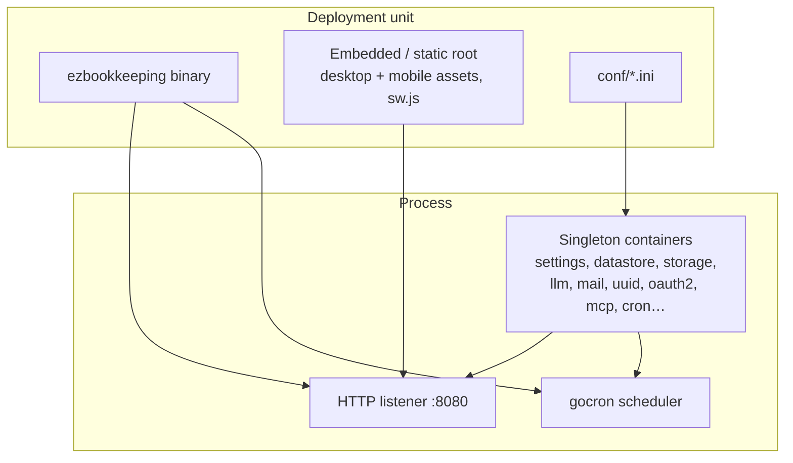
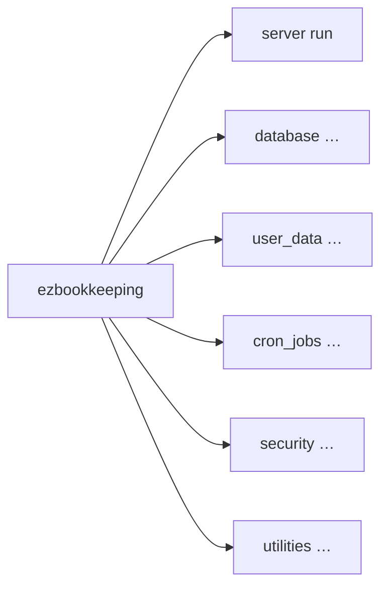
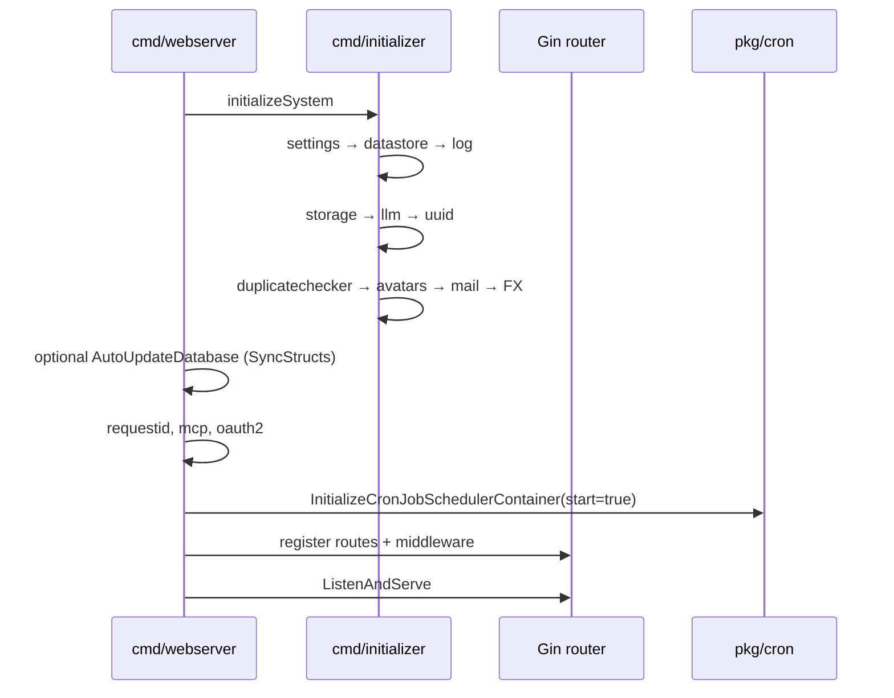
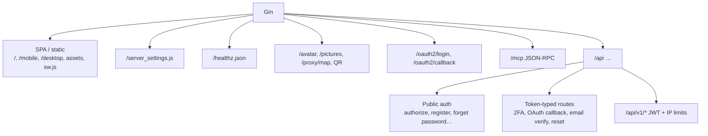
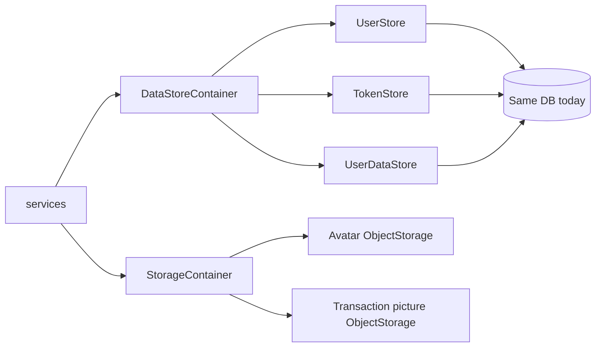
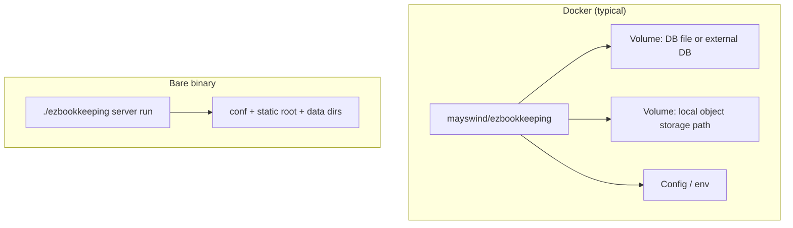

# System overview

## Runtime topology

## CLI surface

Entry: `ezbookkeeping.go` → `urfave/cli/v3`.

| Command | Role |
| --- | --- |
| `server run` | Boot containers, optionally sync schema, serve HTTP + cron |
| `database` | Schema sync / DB maintenance |
| `user_data` | Import/export/clear user data from CLI |
| `cron_jobs` | Run scheduled jobs outside the web process |
| `security` / `utilities` | Ops helpers |

## Boot sequence (`server run`)

Key files:

- `ezbookkeeping.go`
- `cmd/initializer.go`
- `cmd/webserver.go`
- `cmd/database.go`

## HTTP surface (logical)

## Persistence split

`DataStore.Choose(uid)` is sharding-ready but currently always returns the first engine.

## Deployment shapes

Supports SQLite (simple), MySQL, PostgreSQL; x86 / amd64 / ARM; low-resource hosts (Pi, NAS).
